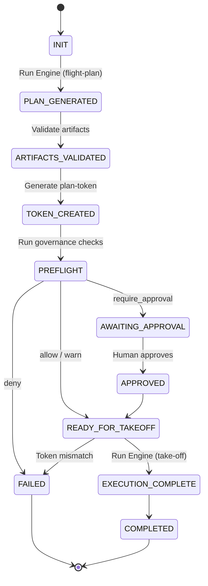
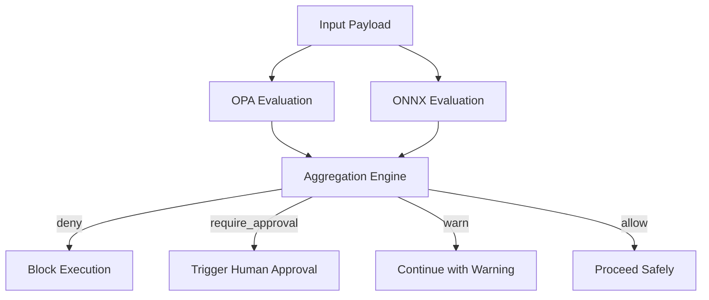
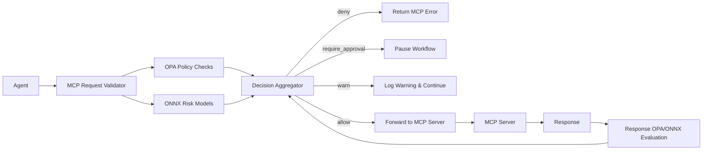
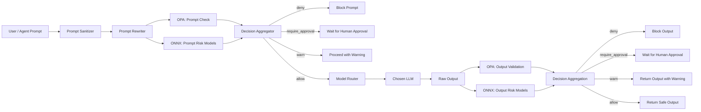
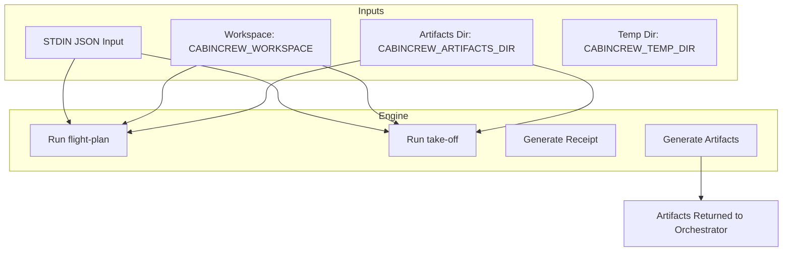
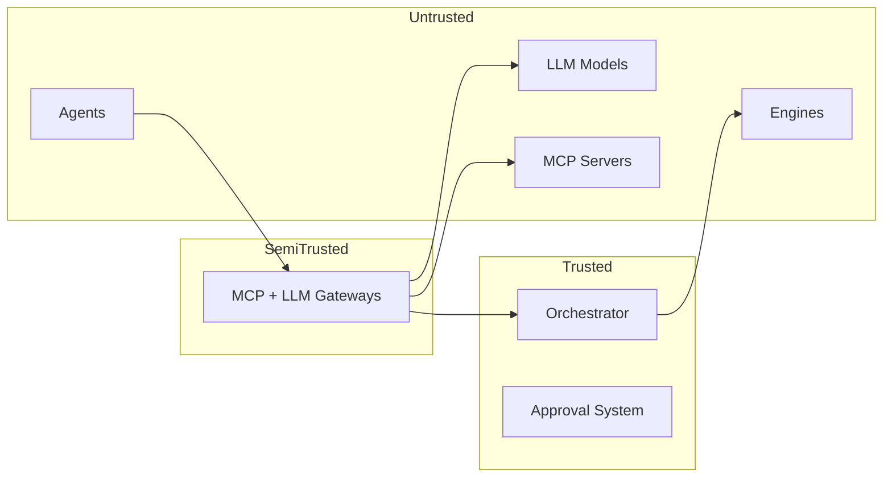

# CabinCrew Architecture Diagrams
Version: draft

This document provides **Mermaid-based architecture diagrams** illustrating the major components, data flows, and trust boundaries of the CabinCrew Protocol.  
These diagrams are non-normative but help implementers visualize the system.

---

# 1. High-Level System Architecture

```mermaid
flowchart LR
    A[User / Agent] --> B[Orchestrator]

    subgraph G1[Governance Layer]
        C1[OPA Policies]
        C2[ONNX Models]
        C3[Approval Workflow]
    end

    B --> G1

    B --> D1[Engine (flight-plan)]
    D1 --> E[Artifacts]
    E --> B

    B --> D2[Engine (take-off)]
    D2 --> F[Side Effects / System Changes]

    subgraph G2[Gateways]
        G21[MCP Gateway]
        G22[LLM Gateway]
    end

    A --> G2 --> B
```

---

# 2. Workflow Lifecycle



---

# 3. Governance Pipeline



---

# 4. MCP Gateway Architecture



---

# 5. LLM Gateway Architecture



---

# 6. Engine Execution Environment



---

# 7. Trust Boundary Diagram



---

# 8. Summary

These diagrams show how CabinCrew:

- isolates untrusted components  
- enforces governance at boundaries  
- validates artifacts before execution  
- ensures deterministic workflow state  
- routes all LLM/MCP traffic through safety firewalls  

They are intended to help implementers understand system responsibilities, trust assumptions, and data flows at a glance.

