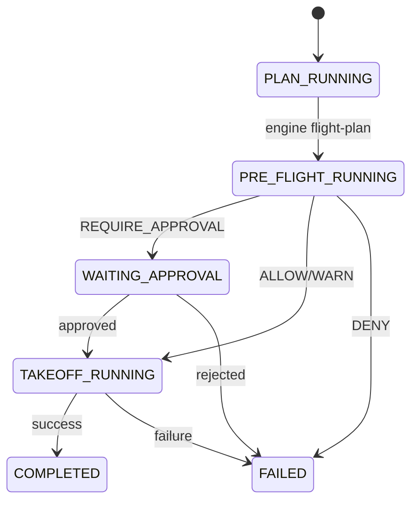

# Orchestrator Specification (Draft)

The **Orchestrator** is the governance and coordination core of the CabinCrew Protocol.
It supervises Engines, Gateways, Policies, and Human-in-the-Loop approvals.

The Orchestrator is responsible for:

1. Executing `flight-plan` and `take-off` phases.
2. Running **Pre-flight** (policy evaluation: OPA + ONNX).
3. Managing **artifact roles** (evidence, state, log).
4. Requesting and processing **human approvals**.
5. Maintaining a **workflow state machine**.
6. Enforcing **sandbox invariants**.
7. Preserving **chain-of-custody** and auditability.


---

# 1. Workflow Overview

CabinCrew workflows follow the pattern:

```
flight-plan → pre-flight → (approval?) → take-off → result
```

The orchestrator guarantees:

- Deterministic execution.
- Artifact integrity.
- Full auditability.
- Optional human approval.
- Zero hidden side effects.

Diagram:

